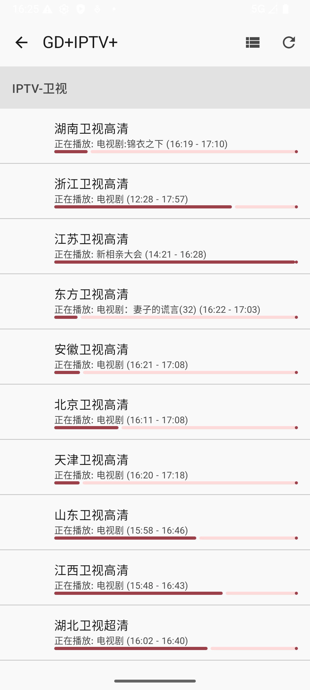

# IPTV Player

一个基于 Android Jetpack Compose 开发的现代 IPTV 播放器应用，支持播放 M3U 格式的 IPTV 播放列表和 XMLTV 格式的电子节目指南 (EPG)。

## 功能特性

- 📺 支持 M3U/M3U8 播放列表
- 📋 电子节目指南 (EPG) 支持 XMLTV 格式
- 🎨 现代化 Material Design 3 界面
- 📱 响应式设计，适配不同屏幕方向和尺寸
- 🌙 深色/浅色主题切换
- 🖥️ 全屏播放模式
- 👆 手势控制（音量、亮度、频道切换）
- 🔧 丰富的设置选项

## 屏幕截图

| 主页 | 频道列表 | 播放界面(竖屏) | 播放界面(横屏) |
|------|----------|----------------|----------------|
|  |  |  |  |

## 技术栈

- **开发语言**: Kotlin
- **UI框架**: Jetpack Compose
- **播放器**: ExoPlayer
- **数据库**: Room
- **架构**: MVVM
- **导航**: Navigation Compose
- **异步处理**: Kotlin Coroutines
- **依赖注入**: 手动 ViewModel 管理

## 安装

1. 克隆项目到本地：
   ```bash
   git clone https://github.com/your-username/iptvplayer.git
   ```

2. 使用 Android Studio 打开项目

3. 构建并运行应用

## 使用说明

### 添加播放列表

1. 在主页点击右下角的 "+" 按钮
2. 输入播放列表名称和 M3U 链接
3. （可选）输入 EPG 链接以获取节目信息
4. 点击"添加"按钮

### 播放频道

1. 在主页选择一个播放列表
2. 在频道列表中点击要播放的频道
3. 进入播放界面观看视频

### 手势控制

在播放界面支持多种手势操作：

- **音量控制**: 在屏幕右侧上下滑动
- **亮度控制**: 在屏幕左侧上下滑动
- **频道切换**: 在屏幕中间左右滑动（需要在设置中启用）
- **全屏切换**: 点击全屏按钮

### 设置选项

在设置界面可以配置：

- **主题**: 跟随系统/浅色/深色
- **频道切换控制**: 滑动手势或双击手势
- **全屏方向**: 跟随系统或锁定横向

## 项目结构

```
app/src/main/java/com/example/iptvplayer/
├── data/
│   ├── local/          # 本地数据存储(Room数据库)
│   └── model/          # 数据模型和状态管理
├── repository/         # 数据仓库
├── ui/
│   ├── home/           # 主页界面
│   ├── channel_list/   # 频道列表界面
│   ├── player/         # 播放器界面
│   ├── settings/       # 设置界面
│   └── theme/          # 主题相关
└── viewmodel/          # 视图模型
```

## 贡献

欢迎提交 Issue 和 Pull Request 来改进这个项目。

## 许可证

[Apache License 2.0](LICENSE)

```